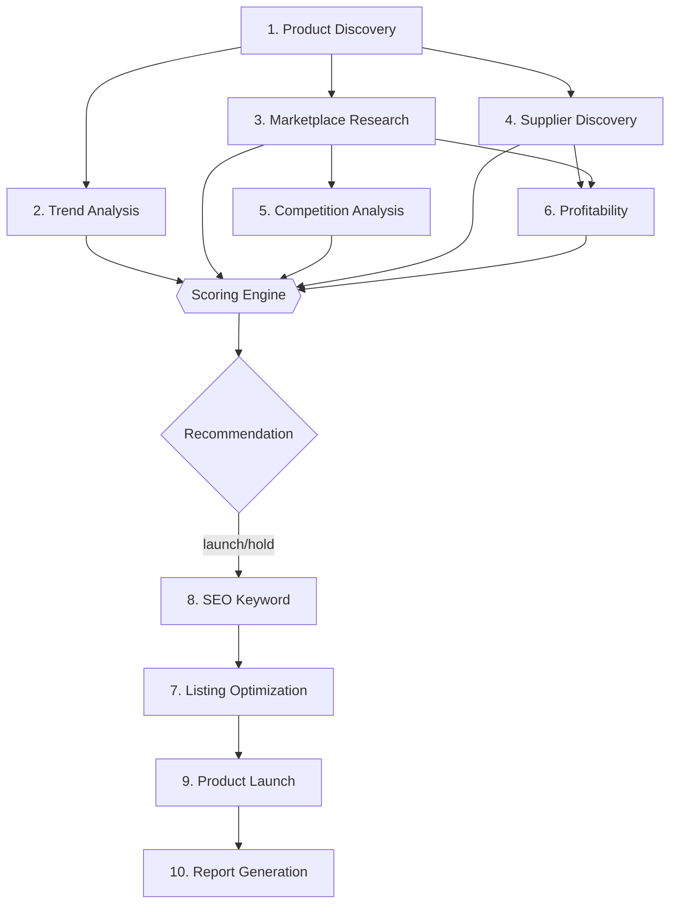

# agents.md — BorderScout AI

The ten specialized AI agents. Each agent is a **stateless** job handler that: reads typed inputs, calls models only via the **Model Gateway**, returns **structured JSON** matching its output schema, and writes an `agent_step` record. Agents never invent verifiable facts (suppliers, prices, fees) — those must come from connectors and are otherwise flagged `unverified` and excluded from scoring.

Common envelope for every agent output:

```json
{
  "agent": "string",
  "version": "string",
  "confidence": 0,
  "sources": [{ "type": "connector|model|cache", "ref": "string" }],
  "data": { }
}
```

---

## 1. Product Discovery Agent

- **Purpose:** Surface candidate products with cross-border potential (best sellers, trending, rising, seasonal, evergreen).
- **Inputs:** `{ marketplace, country, category?, budgetRange?, keywords? }`
- **Tools:** Marketplace connectors (best-seller/search APIs), Elasticsearch product index, embeddings (dedupe).
- **Decision logic:**
  1. Pull best-seller + trending + rising lists from the target marketplace.
  2. Filter to India-sourceable categories and lightweight goods.
  3. Deduplicate via embeddings; cluster near-identical products.
  4. Attach raw demand signals (rank, review velocity, search interest).
- **Outputs:** `{ candidates: [{ productId, title, category, demandSignals, weightG }] }`
- **Workflow:** First node of the opportunity pipeline; fans out to Trend + Supplier agents.

## 2. Trend Analysis Agent

- **Purpose:** Classify trend shape and momentum.
- **Inputs:** `{ productId, historicalRankSeries, searchInterestSeries, reviewVelocitySeries }`
- **Tools:** Time-series from connectors, model for pattern/seasonality reasoning.
- **Decision logic:** Detect rising/declining/stable; flag seasonal vs evergreen; project 90-day demand direction.
- **Outputs:** `{ trendType: "rising|seasonal|evergreen|declining", momentum: 0-100, seasonalityMonths: [], trendScoreInput }`
- **Workflow:** Feeds Trend Score into the Scoring Engine.

## 3. Marketplace Research Agent

- **Purpose:** Quantify marketplace conditions for the product.
- **Inputs:** `{ productId, marketplace, country }`
- **Tools:** Marketplace search/listing connectors, Elasticsearch aggregations.
- **Decision logic:** Estimate demand depth, competitor count/strength, price band, saturation, marketplace fit (category rules, restrictions).
- **Outputs:** `{ demandSignal, competitionSignal, saturationSignal, priceBand, marketplaceFitSignal, restrictions: [] }`
- **Workflow:** Feeds Demand/Competition/Saturation/Marketplace-Fit inputs to Scoring Engine; triggers Competition Agent for top competitors.

## 4. Supplier Discovery Agent

- **Purpose:** Find feasible Indian suppliers and capture sourcing economics.
- **Inputs:** `{ productId, productAttributes }`
- **Tools:** IndiaMART / TradeIndia connectors, verified-supplier DB, model for matching/normalization.
- **Decision logic:** Match product to supplier listings; normalize cost/MOQ/lead time; rate export readiness and quality; rank by feasibility.
- **Outputs:** `{ sourcingCandidates: [{ supplierId, productCostMinor, currency, moq, leadTimeDays, capacityMonth, feasibility, exportExperience }] }`
- **Workflow:** Provides product cost to Profitability Agent; sourcing feasibility to Scoring Engine.

## 5. Competition Analysis Agent

- **Purpose:** Teardown of leading competitor listings.
- **Inputs:** `{ opportunityId, competitorListingIds }`
- **Tools:** Listing connectors, review connectors, model for qualitative analysis.
- **Decision logic:** Score each competitor's listing quality, pricing strategy, review strength; identify weaknesses (Gap Finder feed).
- **Outputs:** `{ competitors: [{ externalId, price, rating, reviewCount, listingQuality, weaknesses: [] }] }`
- **Workflow:** Feeds Competition Score refinement, Product Gap Finder, and Review Intelligence.

## 6. Profitability Agent

- **Purpose:** Build the full landed-cost → net-profit model.
- **Inputs:** `{ opportunityId, productCostMinor, weightG, marketplace, priceBand, fxRate }`
- **Tools:** Marketplace fee schedules, shipping rate tables, tax/duty tables, FX connector.
- **Decision logic:** Compute packaging, intl shipping, FBA/referral/storage fees, ads (ACOS assumption), taxes; derive gross/net profit, ROI, break-even, monthly/annual projections. Deterministic math in `packages/core` — the model only proposes assumptions (price point, ad spend) which are validated against ranges.
- **Outputs:** Full `profit_models` row + `marginScoreInput`.
- **Workflow:** Feeds Margin/Shipping inputs to Scoring Engine.

## 7. Listing Optimization Agent

- **Purpose:** Produce a marketplace-ready listing.
- **Inputs:** `{ opportunityId, productAttributes, marketplace, keywords, painPoints }`
- **Tools:** SEO Keyword Agent output, Review Intelligence pain points, model (Claude) for copy.
- **Decision logic:** Generate SEO title, 5 benefit-led bullets, description, positioning, USPs respecting marketplace style/char limits.
- **Outputs:** `{ seoTitle, bullets: [], description, positioning, usps: [] }` (human-facing copy permitted).
- **Workflow:** Runs after recommendation = `launch`; writes `launch_assets`.

## 8. SEO Keyword Agent

- **Purpose:** Marketplace-specific keyword sets.
- **Inputs:** `{ productId, marketplace, country, competitorKeywords }`
- **Tools:** Keyword connectors, search-term reports, embeddings for clustering.
- **Decision logic:** Mine + cluster keywords; rank by relevance × volume ÷ competition; segment by marketplace (Amazon backend terms, Etsy tags, eBay, Walmart).
- **Outputs:** `{ keywords: { primary: [], secondary: [], longTail: [], backend: [] } }`
- **Workflow:** Feeds Listing Optimization + Keyword Intelligence feature.

## 9. Product Launch Agent

- **Purpose:** Produce the go-to-market plan.
- **Inputs:** `{ opportunityId, profitModel, listingAssets, marketplace }`
- **Tools:** Model + pricing/profit context.
- **Decision logic:** Recommend launch price, launch-phase ad budget, review-velocity strategy, ramp plan; sanity-check against profit model.
- **Outputs:** `{ recommendedPriceMinor, launchStrategy, adBudgetMinor, milestones: [] }`
- **Workflow:** Finalizes the launch kit before reporting.

## 10. Report Generation Agent

- **Purpose:** Compose a complete, exportable opportunity report.
- **Inputs:** `{ opportunityId }` (reads opportunity, scores, sourcing, profit, listing, competition).
- **Tools:** Templating + S3, model for executive summary prose.
- **Decision logic:** Assemble structured sections; generate a concise narrative; render to PDF/JSON.
- **Outputs:** `{ reportId, s3Key, format }`
- **Workflow:** Terminal node; emits `report.created` audit event.

---

## Orchestration



## Shared Agent Rules

1. Timeouts + retries with backoff; partial pipelines allowed.
2. All outputs schema-validated with Zod before persistence.
3. Token/cost recorded per step; budget caps per pipeline per plan.
4. Model-response cache keyed by `(agent, inputHash, modelVersion)`.
5. Prompts, schemas, and eval fixtures live in `packages/agents/<agent>/`.
