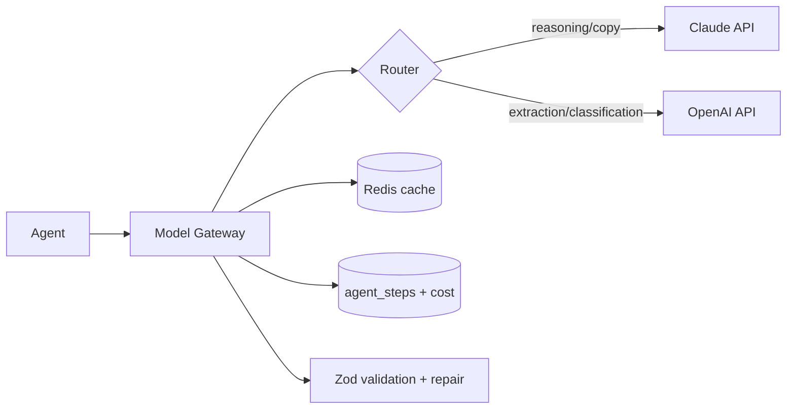

# ai-system.md — BorderScout AI

The AI subsystem: the Model Gateway, prompting standards, model routing, RAG, grounding, caching, evaluation, and cost control. Every model interaction in the platform goes through this layer.

---

## 1. Model Gateway (single choke point)

All agents call models **only** through the gateway. It provides:

- **Provider abstraction** (Claude API, OpenAI API) behind one typed interface.
- **Routing** (which model for which task).
- **Caching** (`agent + inputHash + modelVersion` → response).
- **Cost + token accounting** (per step, per pipeline, per tenant).
- **Structured-output enforcement** (Zod schema validation + repair retry).
- **Logging + tracing** (OpenTelemetry spans), with PII redaction.
- **Fallback** (provider B if provider A fails/over budget).



---

## 2. Model Routing Policy

| Task type | Default | Rationale |
|-----------|---------|-----------|
| Reasoning, recommendation, narrative, copy (listings, brand) | **Claude** | Strong structured reasoning + writing |
| Extraction, classification, normalization | cheaper/faster model | Cost efficiency at volume |
| Embeddings (RAG, dedupe, clustering) | OpenAI embeddings | Vector quality + cost |

Routing is policy-driven and overridable per agent. A `MODEL_PROVIDER=mock` mode replays fixtures for dev/tests.

---

## 3. Prompting Standards

- **System prompt** defines role, output contract (JSON schema), grounding rules, and refusal/uncertainty behaviour.
- **Inputs are data, never instructions** — connector/web content is fenced and explicitly labeled untrusted (prompt-injection defense).
- **Structured output**: agents must return JSON matching their Zod schema; the gateway validates and, on failure, runs one **repair** pass ("return valid JSON for this schema"), then errors.
- **Few-shot fixtures** per agent live in `packages/agents/<agent>/examples`.
- **Determinism**: low temperature for analytical agents; higher only for creative copy/brand.

---

## 4. RAG (Retrieval-Augmented Generation)

- **Vector store**: pgvector (embeddings on products, reviews, keywords).
- Used for: review pain-point clustering, keyword expansion, product deduplication, "similar opportunities."
- Retrieval results are passed as **labeled context**, and any fact used in a decision must still be **connector-grounded** (RAG provides relevance, not truth for prices/fees/suppliers).

---

## 5. Grounding & Hallucination Guard (critical)

> No model-asserted **supplier, price, or fee** influences a score unless verified against a connector.

- Agents return facts with a `source` (`connector|model|cache`).
- The Scoring Engine **ignores** facts whose source is `model`/`unverified` for the numeric inputs that matter (cost, fees, MOQ, demand).
- Verifiable claims are cross-checked against connector fixtures/live data; mismatches are flagged and the opportunity confidence is reduced.

---

## 6. Caching & Cost Control

- Response cache keyed by deterministic input hash + model version (huge savings on re-runs and duplicate products).
- **Per-pipeline budget** (USD) by plan; gateway refuses calls that would exceed it and marks the run `partial`.
- Token usage + cost recorded on every `agent_step` and rolled up to `agent_runs.cost_usd_micro` and the tenant meter.
- Batch embeddings and re-scoring to amortize overhead.

---

## 7. Evaluation Harness

- **Schema conformance** (must be 100%).
- **Grounding eval**: ungrounded facts are correctly flagged and excluded.
- **Regression fixtures**: curated product×marketplace cases; track recommendation stability and score drift across model/prompt changes.
- **LLM-as-judge rubrics** for generative outputs (listing relevance/clarity/marketplace-fit; brand-name quality).
- **Cost/latency budgets** asserted.
- Evals run in CI (`pnpm test:eval`) and gate releases; drift beyond thresholds blocks promotion.

---

## 8. Versioning & Reproducibility

- `modelVersion` and `promptVersion` recorded per step; `scoreVersion` ties recommendations to a formula set.
- Changing a prompt/model that affects scoring requires re-running the regression eval and (if outputs shift) a version bump so historical results stay reproducible.

---

## 9. Safety & Privacy

- PII redaction before provider calls where feasible.
- No secrets in prompts; gateway logs access-controlled.
- Output content filtered for the human-facing assets (no unsafe brand/listing content).
- Untrusted-content isolation prevents tool/instruction hijacking.

---

## 10. Agent ↔ Gateway Contract

```ts
interface ModelGateway {
  run<T>(opts: {
    agent: string;
    task: "reason" | "extract" | "classify" | "write" | "embed";
    schema: ZodSchema<T>;        // structured output contract
    system: string;
    input: unknown;              // fenced as untrusted data
    budgetUsd: number;
    provider?: "auto" | "claude" | "openai";
  }): Promise<{ data: T; sources: Source[]; tokens: TokenUsage; costUsd: number; cached: boolean }>;
}
```

Agents depend on this interface only — never on a provider SDK directly.
