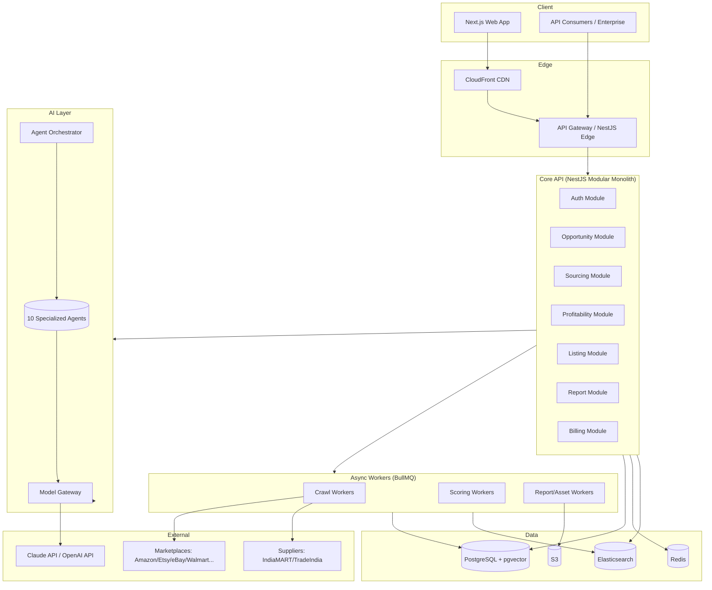
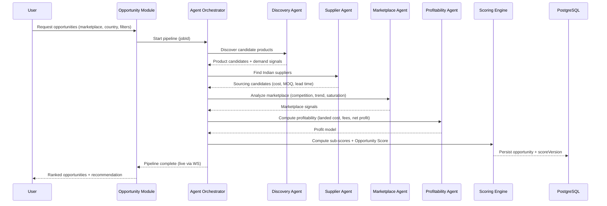
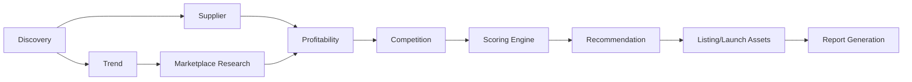

# architecture.md — SellBodr

System architecture: services, data flow, agent orchestration, and deployment topology.

---

## 1. High-Level System Architecture

---

## 2. Module Responsibilities

| Module | Responsibility |
|--------|----------------|
| **Auth** | Sign-up/in, JWT issue/refresh, OAuth, MFA, RBAC enforcement |
| **Opportunity** | Create/score/rank opportunities; orchestrate discovery agents |
| **Sourcing** | Supplier discovery, sourcing candidates, feasibility |
| **Profitability** | Landed cost, fee models, net profit, ROI, break-even |
| **Listing** | Launch assets: title, bullets, description, keywords, pricing |
| **Report** | Compose and export opportunity reports (PDF/JSON) |
| **Billing** | Plans, metering, Stripe webhooks, entitlement checks |

---

## 3. The Opportunity Pipeline (Sequence)

---

## 4. Agent Orchestration Pattern

- The **Agent Orchestrator** runs pipelines as **DAGs of BullMQ jobs**. Each agent is a job handler.
- Agents are **stateless**; they read inputs from PostgreSQL/cache and write structured outputs back.
- Every agent call to a model goes through the **Model Gateway** (logging, cost, caching, fallback).
- Pipeline progress streams to the client over **Socket.IO** keyed by `jobId`.
- Failures are isolated: a failed agent marks its node `failed`, the pipeline continues where possible, and the opportunity is flagged `partial`.

---

## 5. Data Flow & Storage Strategy

| Data | Store | Notes |
|------|-------|-------|
| Entities (users, products, suppliers, opportunities, billing) | PostgreSQL | Source of truth |
| Embeddings (reviews, keywords, products) | pgvector | RAG retrieval |
| Searchable product/keyword index | Elasticsearch | Faceted browse + aggregations |
| Hot scores, sessions, rate limits | Redis | TTL caches |
| Reports, exports, brand assets | S3 | Signed URLs |
| Job queues + pipeline state | Redis (BullMQ) | Idempotent handlers |

---

## 6. Caching Layers

1. **Model response cache** (Redis) keyed by `(agent, promptHash, modelVersion)` — dedupe identical analyses.
2. **Score cache** (Redis) — opportunity scores with TTL; invalidated on re-crawl.
3. **HTTP cache** (CloudFront) — static + cacheable GETs.
4. **Query cache** (Prisma + Redis) — expensive aggregations.

---

## 7. Resilience

- **Circuit breakers** around marketplace/supplier connectors.
- **Retry with backoff + jitter** on transient connector/model failures.
- **Dead-letter queue** for poisoned jobs.
- **Graceful degradation**: if a connector is down, score with available signals and mark confidence lower.

---

## 8. Environments

`local` (docker-compose) → `dev` → `staging` → `production`. Each isolated VPC + DB. See `deployment.md`.
