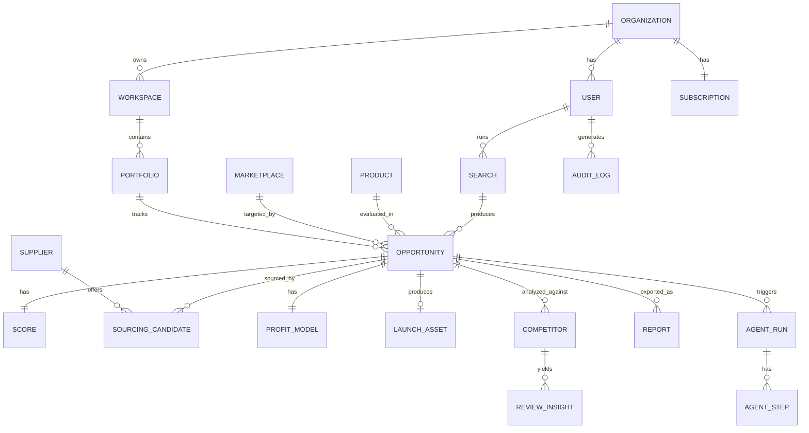

# database.md — BorderScout AI

PostgreSQL schema (via Prisma). Money is stored as **integer minor units** with an explicit currency. All tables have `id (uuid)`, `created_at`, `updated_at`. Soft deletes via `deleted_at` where noted.

---

## 1. Entity-Relationship Overview

---

## 2. Core Tables

### organizations
| Column | Type | Notes |
|--------|------|-------|
| id | uuid PK | |
| name | text | |
| plan | enum(`starter`,`pro`,`agency`,`enterprise`) | |
| white_label_config | jsonb | enterprise theming |
| created_at / updated_at | timestamptz | |

### users
| Column | Type | Notes |
|--------|------|-------|
| id | uuid PK | |
| organization_id | uuid FK → organizations | |
| email | citext UNIQUE | |
| password_hash | text NULL | null if OAuth-only |
| name | text | |
| role | enum(`owner`,`admin`,`member`,`viewer`) | RBAC |
| mfa_secret | text NULL | encrypted (TOTP) |
| mfa_enabled | bool | |
| oauth_provider | enum(`google`,null) | |
| last_login_at | timestamptz | |
| deleted_at | timestamptz NULL | soft delete |

### workspaces
| Column | Type | Notes |
|--------|------|-------|
| id | uuid PK | |
| organization_id | uuid FK | |
| name | text | |
| members | jsonb | user_id → workspace role (agency multi-user) |

### portfolios
| Column | Type | Notes |
|--------|------|-------|
| id | uuid PK | |
| workspace_id | uuid FK | |
| name | text | |
| description | text | |

---

## 3. Discovery & Product Tables

### products
| Column | Type | Notes |
|--------|------|-------|
| id | uuid PK | |
| title | text | normalized product name |
| category | text | taxonomy node |
| attributes | jsonb | material, dimensions, weight_g |
| weight_g | int | for shipping calc |
| is_lightweight | bool | derived |
| hs_code | text NULL | for duties |
| embedding | vector(1536) | pgvector (RAG/dedupe) |

### marketplaces
| Column | Type | Notes |
|--------|------|-------|
| id | uuid PK | |
| code | enum(`amazon_us`,`amazon_uk`,`amazon_de`,`amazon_ca`,`amazon_au`,`etsy`,`ebay`,`walmart`,`shopify`,`tiktok_shop`,`temu`,`noon`,`lazada`,`shopee`) | |
| country | text | ISO code |
| currency | text | ISO 4217 |
| fee_schedule | jsonb | referral %, FBA tiers, storage |
| active | bool | future marketplaces start false |

### searches
| Column | Type | Notes |
|--------|------|-------|
| id | uuid PK | |
| user_id | uuid FK | |
| filters | jsonb | category, marketplace, country, budget |
| status | enum(`queued`,`running`,`complete`,`failed`,`partial`) | |
| started_at / completed_at | timestamptz | |

---

## 4. Opportunity Tables

### opportunities
| Column | Type | Notes |
|--------|------|-------|
| id | uuid PK | |
| search_id | uuid FK | |
| product_id | uuid FK | |
| marketplace_id | uuid FK | |
| portfolio_id | uuid FK NULL | tracked in portfolio |
| status | enum(`scored`,`partial`,`archived`) | |
| recommendation | enum(`launch`,`hold`,`reject`) | |
| confidence | numeric(5,2) | 0–100 |
| score_version | text | reproducibility |
| UNIQUE (search_id, product_id, marketplace_id) | | |

### scores
| Column | Type | Notes |
|--------|------|-------|
| id | uuid PK | |
| opportunity_id | uuid FK UNIQUE | |
| demand | numeric(5,2) | 0–100 |
| competition | numeric(5,2) | 0–100 (higher = less competition) |
| margin | numeric(5,2) | 0–100 |
| saturation | numeric(5,2) | 0–100 |
| trend | numeric(5,2) | 0–100 |
| shipping | numeric(5,2) | 0–100 |
| marketplace_fit | numeric(5,2) | 0–100 |
| opportunity | numeric(5,2) | 0–100 composite |
| breakdown | jsonb | per-signal explainability |

---

## 5. Sourcing Tables

### suppliers
| Column | Type | Notes |
|--------|------|-------|
| id | uuid PK | |
| name | text | |
| source | enum(`indiamart`,`tradeindia`,`verified`,`artisan`,`factory`) | |
| location | text | Indian state/city |
| export_experience | enum(`none`,`some`,`experienced`) | |
| quality_indicators | jsonb | certifications, ratings |
| verified | bool | |

### sourcing_candidates
| Column | Type | Notes |
|--------|------|-------|
| id | uuid PK | |
| opportunity_id | uuid FK | |
| supplier_id | uuid FK | |
| product_cost_minor | bigint | per unit |
| currency | text | usually INR |
| moq | int | minimum order qty |
| lead_time_days | int | |
| production_capacity_month | int | |
| feasibility | enum(`easy`,`moderate`,`hard`) | |

---

## 6. Profitability Tables

### profit_models
| Column | Type | Notes |
|--------|------|-------|
| id | uuid PK | |
| opportunity_id | uuid FK UNIQUE | |
| currency | text | destination currency |
| sale_price_minor | bigint | recommended |
| product_cost_minor | bigint | |
| packaging_cost_minor | bigint | |
| intl_shipping_minor | bigint | |
| fba_fee_minor | bigint | |
| referral_fee_minor | bigint | |
| storage_fee_minor | bigint | |
| ad_cost_minor | bigint | |
| tax_minor | bigint | |
| gross_profit_minor | bigint | |
| net_profit_minor | bigint | |
| roi_pct | numeric(6,2) | |
| breakeven_units | int | |
| monthly_profit_minor | bigint | projection |
| annual_profit_minor | bigint | projection |
| assumptions | jsonb | volume, ad ACOS, fx rate |

---

## 7. Competition & Reviews

### competitors
| Column | Type | Notes |
|--------|------|-------|
| id | uuid PK | |
| opportunity_id | uuid FK | |
| external_id | text | marketplace listing id |
| title | text | |
| price_minor | bigint | |
| rating | numeric(2,1) | |
| review_count | int | |
| listing_quality | numeric(5,2) | 0–100 (Gap Finder) |

### review_insights
| Column | Type | Notes |
|--------|------|-------|
| id | uuid PK | |
| competitor_id | uuid FK | |
| pain_point | text | |
| sentiment | enum(`positive`,`negative`,`neutral`) | |
| frequency | int | mentions |
| embedding | vector(1536) | clustering |

---

## 8. Launch & Reports

### launch_assets
| Column | Type | Notes |
|--------|------|-------|
| id | uuid PK | |
| opportunity_id | uuid FK UNIQUE | |
| seo_title | text | |
| bullets | jsonb | array |
| description | text | |
| keywords | jsonb | marketplace-specific arrays |
| positioning | text | |
| usps | jsonb | |
| recommended_price_minor | bigint | |
| bundle_suggestions | jsonb | |
| brand_concepts | jsonb | names/logo/packaging |

### reports
| Column | Type | Notes |
|--------|------|-------|
| id | uuid PK | |
| opportunity_id | uuid FK | |
| s3_key | text | PDF location |
| format | enum(`pdf`,`json`) | |
| generated_by | uuid FK → users | |

---

## 9. AI & Audit Tables

### agent_runs
| Column | Type | Notes |
|--------|------|-------|
| id | uuid PK | |
| opportunity_id | uuid FK NULL | |
| pipeline | text | e.g. `opportunity_v1` |
| status | enum(`running`,`complete`,`failed`,`partial`) | |
| cost_usd_micro | bigint | model spend |

### agent_steps
| Column | Type | Notes |
|--------|------|-------|
| id | uuid PK | |
| agent_run_id | uuid FK | |
| agent | text | agent name |
| model | text | claude/openai model id |
| input | jsonb | |
| output | jsonb | |
| tokens_in / tokens_out | int | |
| status | enum(`ok`,`failed`,`cached`) | |
| latency_ms | int | |

### audit_logs
| Column | Type | Notes |
|--------|------|-------|
| id | uuid PK | |
| organization_id | uuid FK | |
| actor_user_id | uuid FK NULL | null = system |
| action | text | e.g. `opportunity.created` |
| resource_type | text | |
| resource_id | uuid | |
| metadata | jsonb | before/after |
| ip | inet | |
| created_at | timestamptz | append-only |

### subscriptions
| Column | Type | Notes |
|--------|------|-------|
| id | uuid PK | |
| organization_id | uuid FK UNIQUE | |
| stripe_customer_id | text | |
| stripe_subscription_id | text | |
| plan | enum | mirrors org plan |
| status | enum(`active`,`past_due`,`canceled`,`trialing`) | |
| usage_meters | jsonb | searches, api_calls, reports |
| current_period_end | timestamptz | |

---

## 10. Indexing Strategy

- B-tree FKs on every relation.
- `opportunities (recommendation, confidence DESC)` for ranking.
- `scores (opportunity DESC)` partial index where `status='scored'`.
- GIN on jsonb `filters`, `breakdown`, `keywords`.
- pgvector HNSW on `products.embedding`, `review_insights.embedding`.
- Elasticsearch mirrors `products` + `competitors` for search/aggregations.

## 11. Migrations

Forward-only Prisma migrations. Score formula changes never mutate historic `scores`; a new `score_version` is written. Backfills run as BullMQ jobs.
