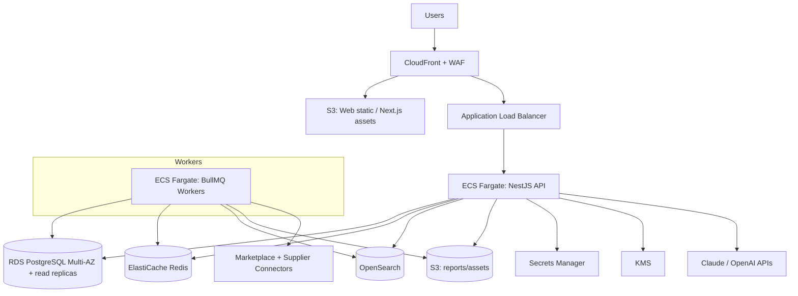
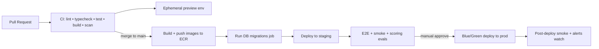

# deployment.md — SellBodr

Deployment topology on AWS, environments, CI/CD, and operational concerns.

---

## 1. Environments

| Env | Purpose | Infra |
|-----|---------|-------|
| **local** | Dev laptops | docker-compose (Postgres, Redis, Elasticsearch, LocalStack-S3) |
| **dev** | Integration | Small AWS footprint, shared |
| **staging** | Pre-prod, e2e, perf | Mirrors prod at smaller scale |
| **production** | Live | Multi-AZ, autoscaled |

Each cloud env = isolated VPC + RDS + ElastiCache + OpenSearch.

---

## 2. AWS Topology

- **Compute:** ECS Fargate in early phases; migrate hot paths (crawlers, scoring, report gen) to **EKS** at scale (see `scaling.md`).
- **API** and **workers** are separate services scaling independently.
- **Web:** Next.js — static/RSC assets on S3+CloudFront; route handlers on the API tier (or Vercel-equivalent container).

---

## 3. CI/CD Pipeline

- **CI gates:** ESLint, `tsc --noEmit`, unit/integration tests, ≥80% core coverage, container scan, SAST, secret scan, scoring eval suite.
- **Images:** built once, promoted across envs (same artifact).
- **Migrations:** forward-only, run as a pre-deploy job; backward-compatible (expand/contract) for zero-downtime.
- **Deploy strategy:** Blue/Green (ALB target group switch) with automatic rollback on health-check failure.

---

## 4. Infrastructure as Code

- **Terraform** modules per concern (network, data, compute, observability), per-env state in S3 + DynamoDB lock.
- No manual console changes in staging/prod (drift detection in CI).

---

## 5. Configuration & Secrets

- Config via env + parameter store; **secrets only in AWS Secrets Manager** (DB creds, API keys, model keys, Stripe keys).
- 12-factor: config separated from code; per-env values injected at deploy.

---

## 6. Observability

- **Prometheus** scrapes API/worker metrics; **Grafana** dashboards (latency, error rate, queue depth, model cost, score throughput).
- **OpenTelemetry** traces across API → orchestrator → agents → connectors.
- **Sentry** for exceptions; **CloudWatch** for infra logs.
- **SLOs:** API p95 < 300ms (read), pipeline completion p95 < target per phase; error budget alerting.

---

## 7. Backups & DR

- RDS automated backups + PITR; cross-region snapshot copies.
- S3 versioning + lifecycle; OpenSearch snapshots to S3.
- RTO/RPO targets documented; quarterly restore drills.

---

## 8. Scaling Hooks

- Autoscaling on ECS service CPU/memory + queue depth (workers scale on BullMQ backlog).
- RDS read replicas for read-heavy dashboards; connection pooling (PgBouncer).
- See `scaling.md` for the full plan.

---

## 9. Release Management

- Semantic versioning of API; deprecation policy (`Sunset` headers).
- Feature flags decouple deploy from release; gradual rollout + kill switch.
- Changelog + runbook updates required per release.
