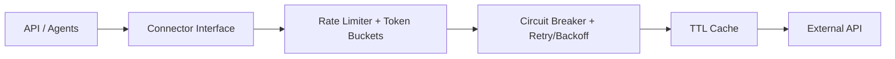

# integrations.md — BorderScout AI

External integrations: marketplaces, suppliers, AI providers, payments, and auth. All external calls live in `packages/connectors` behind typed interfaces. No marketplace/supplier SDK is imported inside `apps/`.

---

## 1. Connector Architecture



Every connector implements a common interface and is wrapped with rate limiting, circuit breaking, retries, and caching. Connectors return **normalized** domain types — never raw upstream payloads.

```ts
interface MarketplaceConnector {
  code: MarketplaceCode;
  searchProducts(q: ProductQuery): Promise<NormalizedProduct[]>;
  getBestSellers(category: string): Promise<NormalizedProduct[]>;
  getListing(externalId: string): Promise<NormalizedListing>;
  getReviews(externalId: string): Promise<NormalizedReview[]>;
  getFeeSchedule(): FeeSchedule;
}

interface SupplierConnector {
  source: SupplierSource;
  searchSuppliers(q: SupplierQuery): Promise<NormalizedSupplierOffer[]>;
  getSupplier(id: string): Promise<NormalizedSupplier>;
}
```

---

## 2. Marketplace Integrations

| Marketplace | Code | Phase | Notes |
|-------------|------|-------|-------|
| Amazon USA | `amazon_us` | 1 | SP-API (catalog, fees, search), best-seller signals |
| Amazon UK/DE/CA/AU | `amazon_uk/de/ca/au` | 2 | SP-API per region |
| Etsy | `etsy` | 2 | Etsy Open API v3 |
| eBay | `ebay` | 2 | Browse + Marketplace Insights APIs |
| Walmart Marketplace | `walmart` | 3 | Walmart Marketplace API |
| Shopify ecosystem | `shopify` | 3 | Storefront/Admin where applicable |
| TikTok Shop | `tiktok_shop` | 3 | TikTok Shop API |
| Temu / Noon / Lazada / Shopee | future | 4 | Connector playbook; flag-gated |

Each marketplace contributes: product/demand signals, competitor listings, reviews, and a **fee schedule** (referral %, FBA tiers, storage) feeding the Profitability Engine.

---

## 3. Supplier Integrations (India sourcing)

| Source | Code | Provides |
|--------|------|----------|
| IndiaMART | `indiamart` | Supplier listings, cost, MOQ, contact signals |
| TradeIndia | `tradeindia` | Supplier listings, capacity, export indicators |
| Verified manufacturers | `verified` | Curated/verified supplier DB |
| Factory suppliers | `factory` | Bulk/production capacity sourcing |
| Artisan suppliers | `artisan` | Handmade/craft sourcing |

Where official APIs are limited, connectors use compliant data acquisition with strict rate limits, caching, and ToS adherence; data is normalized to `NormalizedSupplierOffer` (cost, MOQ, lead time, capacity, export experience, quality indicators).

---

## 4. Supporting Data Connectors

| Integration | Purpose |
|-------------|---------|
| FX rate provider | Currency conversion for landed cost/profit |
| Shipping rate tables | International shipping cost estimation by weight/zone |
| Duty/tax tables (HS code) | Destination duties + marketplace taxes |
| Keyword/search-volume sources | SEO Keyword + Keyword Intelligence |

---

## 5. AI Providers

| Provider | Use | Doc |
|----------|-----|-----|
| **Claude API** | Reasoning, recommendations, copy | via Model Gateway (`ai-system.md`) |
| **OpenAI API** | Extraction/classification fallback, embeddings | via Model Gateway |

Never called directly by agents — only through the Model Gateway.

---

## 6. Platform Integrations

| Integration | Purpose |
|-------------|---------|
| **Stripe** | Subscriptions, metered usage, webhooks (`monetization.md`) |
| **Google OAuth** | Social sign-in (`security.md`) |
| **AWS (S3/KMS/Secrets/SES)** | Storage, encryption, secrets, transactional email |
| **Sentry / Prometheus / Grafana / OTel** | Observability (`deployment.md`) |

---

## 7. Reliability & Compliance for Connectors

- **Rate limiting**: per-source token buckets; global scheduler spreads crawl load.
- **Circuit breakers**: open on sustained failures; degrade gracefully (score with available signals, lower confidence).
- **Retries**: exponential backoff + jitter; dead-letter on exhaustion.
- **Caching**: TTL per data type; re-fetch only when stale.
- **ToS & legal**: respect each provider's API terms and robots/usage policies; prefer official APIs; store only what's needed.
- **Contract tests**: recorded fixtures + periodic live checks in staging to catch upstream changes (`testing.md`).
- **Secrets**: connector credentials in AWS Secrets Manager, rotated.

---

## 8. Webhooks (inbound)

| Source | Event | Handler |
|--------|-------|---------|
| Stripe | subscription/invoice events | Billing module (signature-verified, idempotent) |
| (Future) Marketplace | order/listing status | normalized + queued |

---

## 9. Adding a Connector (checklist)

1. Implement the typed interface; normalize all outputs.
2. Add rate-limit + circuit-breaker config.
3. Provide fee/shipping/tax data where relevant.
4. Add recorded fixtures + live contract test.
5. Register in the connector registry; flag-gate rollout.
