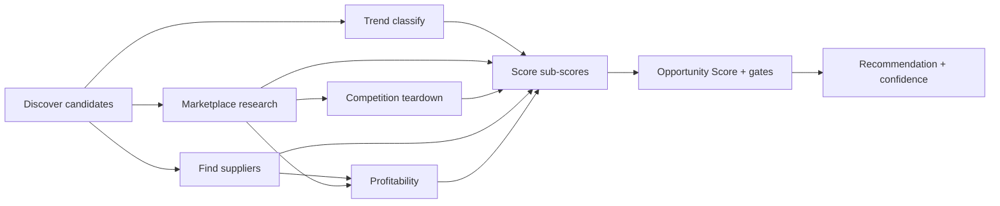

# marketplace-intelligence.md — SellBodr

The heart of the product: the **scoring formulas**, the **profitability math**, the **recommendation logic**, and the **research workflows**. Implemented once in `packages/core/scoring` and `packages/core/profit`, versioned via `scoreVersion`. **Current version: `2.0.0`.**

All sub-scores are normalized to **0–100** where **higher is always better for the seller** (note: a high Competition score means *low* competition; a high Saturation score means *low* saturation).

---

## 1. Sub-Scores

Each sub-score is a normalized blend of weighted, bounded signals. Signals are min-max normalized against marketplace/category baselines, then clamped to [0,100].

### 1.1 Demand Score
Captures how much the market wants this product.

```
Demand = clamp(
  0.35 * norm(searchVolume) +
  0.25 * norm(salesRankInverse) +
  0.20 * norm(reviewVelocity) +
  0.20 * norm(categoryGrowth)
, 0, 100)
```
- `salesRankInverse`: better rank → higher value.
- `reviewVelocity`: reviews/month across top listings (demand proxy).

### 1.2 Competition Score (higher = less competition)
```
Competition = clamp(
  100 - (
    0.40 * norm(activeSellerCount) +
    0.30 * norm(avgReviewCountTop10) +
    0.30 * norm(brandDominance)
  )
, 0, 100)
```
- `brandDominance`: share held by top branded listings.

### 1.3 Margin Score
Derived from the Profitability Engine's net margin %.
```
netMarginPct = netProfit / salePrice * 100
Margin = clamp( scaleMargin(netMarginPct) , 0, 100)
// scaleMargin: 0% → 0, 15% → 40, 30% → 70, 45%+ → 100 (piecewise linear)
```

### 1.4 Market Saturation Score (higher = less saturated)
```
Saturation = clamp(
  100 - (
    0.50 * norm(newListingsPerMonth) +
    0.30 * norm(priceCompression) +     // shrinking price spread = saturated
    0.20 * norm(adDensity)              // crowded sponsored slots
  )
, 0, 100)
```

### 1.5 Trend Score
From the Trend Analysis Agent.
```
Trend = clamp(
  0.50 * momentum +                      // 0–100 rising momentum
  0.30 * trendTypeWeight +               // rising=100, evergreen=80, seasonal(in-season)=70, seasonal(off)=20, declining=0
  0.20 * norm(searchInterestSlope)
, 0, 100)
```

### 1.6 Shipping Score
Favors lightweight, easily shipped goods.
```
Shipping = clamp(
  0.50 * weightScore +                   // lighter = higher (e.g. <250g→100, >2kg→20)
  0.25 * dimWeightScore +                // small dims = higher
  0.15 * fragilityScore +                // robust = higher
  0.10 * sourcingLeadTimeScore           // shorter lead time = higher
, 0, 100)
```

### 1.7 Marketplace Fit Score
How well the product fits the chosen marketplace/country.
```
MarketplaceFit = clamp(
  0.40 * categoryFitWeight +             // category allowed/strong on this marketplace
  0.25 * (100 - restrictionPenalty) +    // gating/compliance restrictions reduce fit
  0.20 * audienceFitWeight +             // marketplace audience vs product
  0.15 * priceBandFitWeight              // price point fits marketplace norms
, 0, 100)
```

---

## 2. Opportunity Score (composite, 0–100)

Weighted blend of the seven sub-scores. Default weights (`scoreVersion 2.0.0`):

| Sub-score | Weight |
|-----------|:--:|
| Demand | 0.22 |
| Margin | 0.20 |
| Competition | 0.16 |
| Trend | 0.14 |
| Marketplace Fit | 0.12 |
| Shipping | 0.10 |
| Saturation | 0.06 |

```
Opportunity = round(
  0.22*Demand + 0.20*Margin + 0.16*Competition +
  0.14*Trend + 0.12*MarketplaceFit + 0.10*Shipping + 0.06*Saturation
)
// then apply gates ↓
```

**Hard gates** (override the weighted score):
- If `Margin < 30` → Opportunity capped at 49 (never "Launch").
- If `Shipping < 25` (too heavy/fragile to ship cross-border profitably) → capped at 55.
- If `MarketplaceFit < 30` (restricted/gated) → capped at 45.
- If sourcing feasibility = `hard` for all candidates → −10 penalty.

Sourcing feasibility (easy/moderate/hard), an India-sourcing-native input, modifies the score via the Shipping lead-time term and the penalty above.

---

## 3. Recommendation Logic

```
if Opportunity >= 80 and Margin >= 35 and no blocking restriction: "launch"
elif Opportunity >= 60: "hold"      // promising but needs validation
else: "reject"
```

**Confidence (%)** reflects data completeness and grounding:
```
confidence = clamp(
  base(Opportunity) *
  dataCompletenessFactor *      // fraction of signals grounded by connectors
  groundingFactor               // penalize unverified facts
, 0, 100)
```
Unverified suppliers/prices/fees lower `groundingFactor`.

### Worked Example (matches product spec)
Handmade Wooden Desk Organizer → Amazon USA:
Demand 91, Competition 42, Margin 87, Shipping 82 (Trend 78, Fit 80, Saturation 55 from research) →
Opportunity ≈ **89**, Margin ≥ 35, no blocking restriction → **Launch**, **Confidence 92%**.

---

## 4. Profitability Math (deterministic, `packages/core/profit`)

All money in integer minor units; one currency per calculation; FX applied explicitly.

```
landedCost      = productCost + packaging + intlShipping + duties
marketplaceFees = referralFee + fbaFee + storageFee
grossProfit     = salePrice - landedCost - marketplaceFees
netProfit       = grossProfit - adCost - tax
roiPct          = netProfit / (landedCost + adCost) * 100
breakevenUnits  = ceil(fixedLaunchCost / max(netProfit, 1))
monthlyProfit   = netProfit * estMonthlyVolume
annualProfit    = monthlyProfit * 12
```

- `referralFee = salePrice * marketplace.referralPct`
- `fbaFee` from the marketplace's size/weight tier table.
- `adCost = salePrice * estMonthlyVolume-weighted ACOS` (assumption, validated to a plausible range).
- `tax` per destination rules / marketplace-collected.
- Assumptions (price point, ACOS, volume, FX) are model-proposed but **clamped to validated ranges**; the arithmetic is pure and unit-tested.

---

## 5. Research Workflows

### 5.1 Product Opportunity Workflow


### 5.2 Product Gap Finder Workflow
1. Filter to high Demand + high Competition score (low competition).
2. Pull top competitor listings; compute `listingQuality`.
3. Flag where best listings are weak (poor titles/images/low quality) → gap.
4. Boost these in ranking; surface "weak incumbents" rationale.

### 5.3 Review Intelligence Workflow
1. Collect competitor reviews via connectors.
2. Embed + cluster; extract pain points.
3. Rank by frequency × negativity.
4. Feed pain points into Listing Optimization (turn pains into USPs).

### 5.4 Keyword Intelligence Workflow
1. Seed from product + competitors.
2. Expand via embeddings + search-volume sources.
3. Cluster and rank: `relevance × volume ÷ competition`.
4. Segment per marketplace (Amazon backend, Etsy tags, eBay, Walmart).

### 5.5 Continuous Re-Scoring
Scheduled crawls refresh signals → re-score with current `scoreVersion` → notify users when an opportunity crosses a threshold (e.g., rises into "Launch" or drops out).

---

## 6. Versioning Rules

- Any change to weights, signal definitions, gates, or normalization → **bump `scoreVersion`**.
- Historical `scores` rows are immutable; re-scoring writes new rows tagged with the new version.
- Golden + property tests (`testing.md`) protect each version; regression evals run before promotion.

---

## 7. Explainability

Every score persists a `breakdown` (jsonb): each signal's raw value, normalized value, weight, and contribution — powering the "Why this recommendation" UI and audit.
