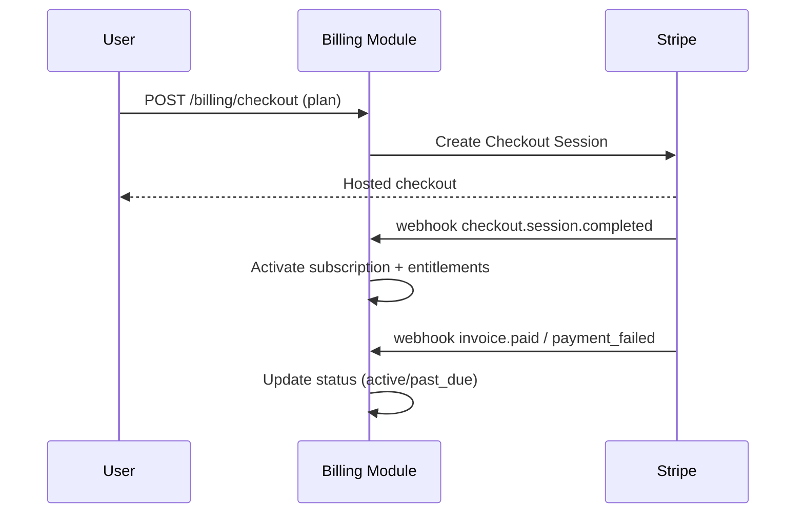

# monetization.md — SellBodr

Pricing, plans, metering, and billing implementation.

---

## 1. Plans & Tiers

| | **Free** | **Pro** | **Organisation** |
|---|---|---|---|
| Price | $0 — no credit card required | $49 / month | Custom (contact sales) |
| AI searches (total lifetime) | 5 | Unlimited | Unlimited |
| Opportunity results per marketplace per search | 10 | Unlimited | Unlimited |
| Suppliers per product | 10 | Unlimited | Unlimited |
| Opportunity Score display | Gauge visible (preview only) | Full 7-dimension breakdown | Full 7-dimension breakdown |
| Recommendation badge | Basic badge visible | Full Launch / Hold / Reject + confidence | Full Launch / Hold / Reject + confidence |
| Wishlist / saves | Supported | Supported | Supported |
| Profitability model | ProGate (locked) | ✓ | ✓ |
| AI Listing Generator | ProGate (locked) | ✓ | ✓ |
| Ads campaign structure | ProGate (locked) | ✓ | ✓ |
| Growth signals | ProGate (locked) | ✓ | ✓ |
| Recommendations dashboard | ProGate (locked) | ✓ | ✓ |
| Reports & export | ProGate (locked) | ✓ | ✓ |
| Marketplace Intelligence | ProGate (locked) | ✓ | ✓ |
| Supplier sourcing map | ProGate (locked) | ✓ | ✓ |
| AI providers | Groq + Mistral (free tier) | All (Claude, GPT-4, Groq, Mistral, etc.) | All |
| Multi-seat / team | — | — | ✓ |
| API access | — | — | ✓ |
| White-label reports | — | — | ✓ |
| Support | Community | Standard | Dedicated account manager + SLA |

**Plan enforcement:** plan stored in `user.plan` column (`free` \| `pro`); JWT carries a `plan` claim consumed by the `EntitlementGuard`. Role `admin` or email `sellbodr@gmail.com` bypasses all limits. Free search quota is enforced server-side and returns HTTP `429` with `limitReached: true` when the 5-search ceiling is reached.

---

## 2. Pricing Model

- **Subscription** (per seat for Pro; per org for Organisation) is the primary revenue line.
- Free tier is permanently free with hard lifetime caps (5 searches); no time-limited trial — value is demonstrated within the cap.
- Organisation pricing is negotiated annually and covers multi-seat access, API volume, and optional white-label configuration.

---

## 3. Metering

Tracked in `subscriptions.usage_meters` (jsonb) and Redis counters (real-time), reconciled to Stripe where applicable:

| Meter | Unit | Limit (Free) | Limit (Pro / Org) | Enforcement |
|-------|------|--------------|-------------------|-------------|
| `searches` | total count (lifetime) | 5 | Unlimited | Hard — HTTP `429` + `limitReached: true` |
| `results_per_search` | count per marketplace per run | 10 | Unlimited | Hard — truncated server-side |
| `suppliers_per_product` | count | 10 | Unlimited | Hard — truncated server-side |
| `api_calls` | count/period | — | Per Organisation contract | Hard — `429` |
| `model_cost_usd` | micro-USD | Groq/Mistral only | All providers; per-pipeline budget guard | Circuit-break on overrun |

- All ProGate dashboards (Profitability, Listing, Ads, Growth, Recommendations, Reports, Marketplace Intelligence) return a gate response for Free users — no data is fetched.
- AI provider routing: Free users are restricted to Groq and Mistral free-tier endpoints. Pro/Org users have access to all configured providers (Claude, GPT-4o, Groq, Mistral, etc.) via the model gateway.
- Hard limits return `429`; gated pages show a ProGate upgrade prompt. There are no soft-limit warn banners at this stage.

---

## 4. Billing Implementation (Stripe)

- **Entitlements** derived from plan → enforced by a NestJS `EntitlementGuard` on gated routes.
- **Webhooks** signature-verified; idempotent handlers.
- **Customer portal** for self-serve plan changes, cancellation, invoices.
- **Proration** handled by Stripe on upgrades/downgrades.
- Usage add-ons reported to Stripe via metered billing items.

---

## 5. Free → Paid Conversion

- Free delivers real search results (up to 10 results per marketplace, 10 suppliers per product) and shows the Opportunity Score gauge and recommendation badge — enough to demonstrate value within 5 searches.
- Upgrade nudges fire at natural friction points: hitting the 5-search ceiling (hard block with upgrade prompt), attempting to open any ProGate dashboard, or trying to view the full score breakdown or profitability model.
- Wishlist is available on Free to encourage save behaviour before upgrading.

---

## 6. Revenue Protection

- Abuse controls: per-pipeline cost cap, rate limits, anomaly detection on usage spikes.
- API keys metered + scoped; overage billed or throttled per contract.
- Chargeback/fraud handling via Stripe Radar.

---

## 7. Unit Economics Levers

- **COGS = model spend + infra.** Model gateway caching, model routing (cheaper model for non-critical steps), and batch re-scoring reduce per-opportunity cost.
- Track **gross margin per opportunity** and **per plan** in Grafana to keep pricing sustainable.

---

## 8. Future Monetization

- Supplier-introduction premium features (still not a B2B marketplace — informational only).
- Marketplace expansion packs (Temu/Noon/Lazada/Shopee) as add-ons.
- Data/insights API for partners (governed, privacy-safe, aggregated).
