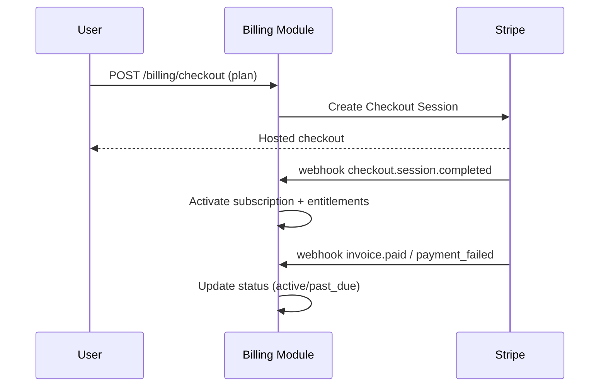

# monetization.md — SellBodr

Pricing, plans, metering, and billing implementation.

---

## 1. Plans & Tiers

### Competitive positioning
| Competitor | Entry price | SellBodr advantage |
|---|---|---|
| Jungle Scout | $49/mo | India sourcing intelligence, multi-marketplace, 59% cheaper on Growth |
| Helium 10 | $39/mo (Starter, limited) | No India sourcing, Amazon-only focus |
| Viral Launch | $69/mo | No India sourcing, higher price |
| Zik Analytics | $29.99/mo | eBay-only, no sourcing data |

### Plan matrix

| | **Starter** | **Pro** |
|---|---|---|
| Price (INR / monthly) | ₹0 | ₹1,499/mo |
| Price (USD / monthly) | $0 | $19/mo |
| Price (annual, −20%) | — | ₹1,199/mo · $15/mo |
| AI searches / month | 5 (lifetime) | 100/mo |
| Results per scan | 10 | 30 |
| Suppliers per product | 10 | Unlimited |
| Opportunity Score | Full 7-dimension | Full 7-dimension |
| Recommendation badge | ✓ | ✓ |
| Wishlist / saves | ✓ | ✓ |
| Profitability model | ProGate | ✓ |
| AI Listing Generator | ProGate | ✓ |
| Ads campaign structure | ProGate | ✓ |
| Growth signals | ProGate | ✓ |
| Recommendations dashboard | ProGate | ✓ |
| Reports & export (CSV/Excel/PDF/Word) | ProGate | ✓ |
| Marketplace Intelligence | ProGate | ✓ |
| Supplier sourcing map | ProGate | ✓ |
| AI providers | Groq + Mistral | Claude + Groq + Mistral |
| Support | Community | Priority email |

**Plan enforcement:** plan stored in `user.plan` column (`free` \| `pro`); JWT carries a `plan` claim consumed by the `EntitlementGuard`. Role `admin` or email `sellbodr@gmail.com` bypasses all limits. Free search quota is enforced server-side and returns HTTP `429` with `limitReached: true` when the 5-search ceiling is reached.

**DB mapping:** Pro → `pro` plan value in the `user.plan` column (unchanged).

### AI Generation Credits (pay-as-you-go)
Credits cover on-demand AI generation: Reports, Ads copy, Brand assets, Listing copy, Growth playbooks. **1 credit = 1 generation.** Credits work on any plan and never expire.

| Currency | Price | Credits |
|---|---|---|
| INR (Razorpay) | ₹499 | 10 credits |
| USD (Stripe) | $5 | 10 credits |

---

## 2. Pricing Model

- **Subscription** (monthly or annual) is the primary revenue line. Annual billing carries a 20% discount baked into monthly rate (shown as "Save ₹X,XXX/yr" or "Save $XX/yr").
- Free tier is permanently free with hard lifetime caps (5 searches); no time-limited trial — value is demonstrated within the cap.
- Pro plan pricing is configurable via admin platform settings (`pro_price_usd`, `agency_price_usd`). INR prices are hardcoded to ₹1,499 (Growth) and ₹3,499 (Pro) until a Razorpay subscription flow is implemented.
- **Payment gateways:** Stripe for USD subscriptions; Razorpay for INR credit purchases (one-time). Razorpay subscription billing to be added in a future sprint.
- Pricing is presented with INR as the default currency on the landing page (toggle to USD). This reflects the primary India-based seller audience.

---

## 3. Metering

Tracked in `subscriptions.usage_meters` (jsonb) and Redis counters (real-time), reconciled to Stripe where applicable:

| Meter | Unit | Limit (Free) | Limit (Pro / Org) | Enforcement |
|-------|------|--------------|-------------------|-------------|
| `searches` | total count (lifetime) | 5 | Unlimited | Hard — HTTP `429` + `limitReached: true` |
| `results_per_search` | count per marketplace per run | 10 | Unlimited | Hard — truncated server-side |
| `suppliers_per_product` | count | 10 | Unlimited | Hard — truncated server-side |
| `api_calls` | count/period | — | Per Organisation contract | Hard — `429` |
| `model_cost_usd` | micro-USD | Groq/Mistral only | All providers; per-pipeline budget guard | Circuit-break on overrun |

- All ProGate dashboards (Profitability, Listing, Ads, Growth, Recommendations, Reports, Marketplace Intelligence) return a gate response for Free users — no data is fetched.
- AI provider routing: Free users are restricted to Groq and Mistral free-tier endpoints. Pro/Org users have access to all configured providers (Claude, GPT-4o, Groq, Mistral, etc.) via the model gateway.
- Hard limits return `429`; gated pages show a ProGate upgrade prompt. There are no soft-limit warn banners at this stage.

---

## 4. Billing Implementation (Stripe)

- **Entitlements** derived from plan → enforced by a NestJS `EntitlementGuard` on gated routes.
- **Webhooks** signature-verified; idempotent handlers.
- **Customer portal** for self-serve plan changes, cancellation, invoices.
- **Proration** handled by Stripe on upgrades/downgrades.
- Usage add-ons reported to Stripe via metered billing items.

---

## 5. Free → Paid Conversion

- Starter delivers real search results (up to 10 results per marketplace, 10 suppliers per product) and shows the full Opportunity Score and recommendation badge — enough to demonstrate value within 5 scans.
- Upgrade nudges fire at natural friction points: hitting the 5-scan ceiling (hard block with upgrade prompt at ₹1,499/mo), attempting to open any ProGate dashboard, or trying to export data.
- Wishlist is available on Starter to encourage save behaviour before upgrading.
- Pro plan (₹1,499/$19/mo) is positioned as the primary conversion target — undercuts all major competitors while unlocking the full platform.

---

## 6. Revenue Protection

- Abuse controls: per-pipeline cost cap, rate limits, anomaly detection on usage spikes.
- API keys metered + scoped; overage billed or throttled per contract.
- Chargeback/fraud handling via Stripe Radar.

---

## 7. Unit Economics Levers

- **COGS = model spend + infra.** Model gateway caching, model routing (cheaper model for non-critical steps), and batch re-scoring reduce per-opportunity cost.
- Track **gross margin per opportunity** and **per plan** in Grafana to keep pricing sustainable.

---

## 8. Future Monetization

- Supplier-introduction premium features (still not a B2B marketplace — informational only).
- Marketplace expansion packs (Temu/Noon/Lazada/Shopee) as add-ons.
- Data/insights API for partners (governed, privacy-safe, aggregated).
