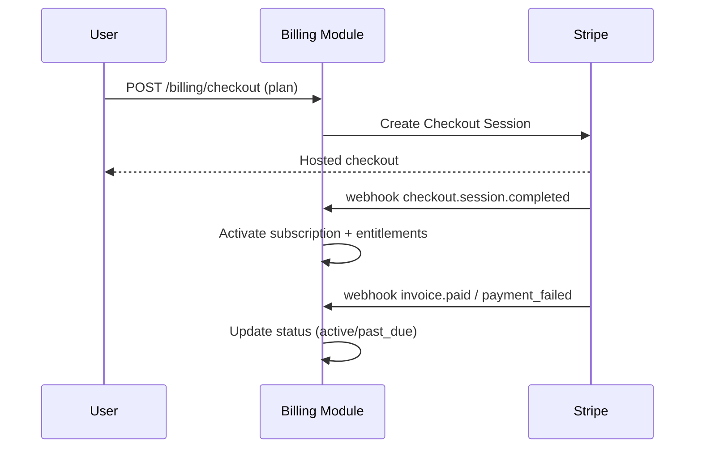

# monetization.md — SellBodr

Pricing, plans, metering, and billing implementation.

---

## 1. Plans & Tiers

| | **Starter** | **Pro Seller** | **Agency** | **Enterprise** |
|---|---|---|---|---|
| Price (indicative) | Free / low | Mid monthly | Higher monthly | Custom |
| Searches | Limited (e.g. 5/mo) | Unlimited* | Unlimited* | Unlimited* |
| Marketplaces | 1 (Amazon USA) | All active | All active | All + custom |
| Advanced analytics | — | ✓ | ✓ | ✓ |
| Advanced finders (Gap/Bundle/Review/Keyword) | — | ✓ | ✓ | ✓ |
| AI Brand Builder | — | ✓ | ✓ | ✓ |
| Multi-user | — | — | ✓ (seats) | ✓ |
| Portfolio management | — | — | ✓ | ✓ |
| Reports | watermarked | ✓ | ✓ | ✓ |
| API access | — | — | — | ✓ |
| White-label | — | — | — | ✓ |
| Support | community | standard | priority | dedicated + SLA |

\* "Unlimited" governed by fair-use + per-pipeline model-cost budgets to prevent abuse.

---

## 2. Pricing Model

- **Subscription** (per org/seat) is the primary revenue line.
- **Usage-based add-ons** for heavy consumers: extra search packs, bulk scoring credits, additional API call volume, premium report exports.
- **Enterprise**: annual contracts, custom marketplaces, volume API pricing, white-label fee.

---

## 3. Metering

Tracked in `subscriptions.usage_meters` (jsonb) and Redis counters (real-time), reconciled to Stripe:

| Meter | Unit | Used for |
|-------|------|----------|
| `searches` | count/period | Starter limit, fair-use |
| `opportunities_scored` | count | analytics, soft caps |
| `api_calls` | count | Enterprise billing |
| `reports_generated` | count | add-on packs |
| `model_cost_usd` | micro-USD | per-pipeline budget guard |

- Soft limit → warn banner; hard limit → upgrade prompt / `402`/`429`.
- Model-cost budget per pipeline scales with plan; exceeding it circuit-breaks the run.

---

## 4. Billing Implementation (Stripe)

- **Entitlements** derived from plan → enforced by a NestJS `EntitlementGuard` on gated routes.
- **Webhooks** signature-verified; idempotent handlers.
- **Customer portal** for self-serve plan changes, cancellation, invoices.
- **Proration** handled by Stripe on upgrades/downgrades.
- Usage add-ons reported to Stripe via metered billing items.

---

## 5. Free → Paid Conversion

- Starter delivers one full, real opportunity (watermarked report) to demonstrate value.
- Upgrade nudges at natural friction points: marketplace lock, advanced finder lock, search limit, watermark.

---

## 6. Revenue Protection

- Abuse controls: per-pipeline cost cap, rate limits, anomaly detection on usage spikes.
- API keys metered + scoped; overage billed or throttled per contract.
- Chargeback/fraud handling via Stripe Radar.

---

## 7. Unit Economics Levers

- **COGS = model spend + infra.** Model gateway caching, model routing (cheaper model for non-critical steps), and batch re-scoring reduce per-opportunity cost.
- Track **gross margin per opportunity** and **per plan** in Grafana to keep pricing sustainable.

---

## 8. Future Monetization

- Supplier-introduction premium features (still not a B2B marketplace — informational only).
- Marketplace expansion packs (Temu/Noon/Lazada/Shopee) as add-ons.
- Data/insights API for partners (governed, privacy-safe, aggregated).
