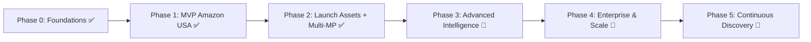

# roadmap.md — SellBodr

A phased plan from MVP to Enterprise. Each phase is shippable and gated by the success criteria listed.

> **Status as of August 2026:** Phases 0–3 are fully shipped. Phase 4 is mostly complete (frontend). Phase 5 feedback loop and freshness UI are shipped; continuous crawl pipeline is not yet started.

---

## ✅ Phase 0 — Foundations (SHIPPED)

**Goal:** Repo, infra, auth, and the scoring core exist.

- ✅ Turborepo + pnpm monorepo scaffolding
- ✅ NestJS API skeleton, Next.js web skeleton
- ✅ Turso (LibSQL) database provisioned (replaced original PostgreSQL + Redis + Elasticsearch plan)
- ✅ Auth: JWT + RBAC roles seeded
- ✅ `packages/core/scoring` with versioned formulas + unit tests
- ✅ CI pipeline (lint, typecheck, test, build)

**Exit criteria met:** A user can sign up, log in, and the scoring functions are tested and importable.

---

## ✅ Phase 1 — MVP: Single-Marketplace Opportunity Engine (SHIPPED)

**Goal:** End-to-end for **India → Amazon USA** only.

- ✅ Product Discovery Agent (best sellers, trending, rising)
- ✅ Marketplace Research Agent (demand/competition signals)
- ✅ Profitability Engine (Amazon FBA fee model, landed cost, net profit, ROI, break-even)
- ✅ Opportunity Score v1 computed and stored
- ✅ Supplier Discovery Agent (IndiaMART/TradeIndia connectors, basic)
- ✅ Opportunity Dashboard (Scout page) + Product Research tab
- ✅ AI Recommendation card (Launch/Hold/Reject + confidence%)
- ✅ Free & Pro tiers with metering

**Exit criteria met:** A Pro user gets a ranked list of Amazon USA opportunities with sourcing and full profit breakdown.

---

## ✅ Phase 2 — Launch Assets + Multi-Marketplace (SHIPPED)

**Goal:** Make recommendations actionable and expand marketplaces.

### Originally planned — all shipped:
- ✅ Listing Optimization Agent + SEO Keyword Agent
- ✅ AI Launch Assets (marketplace-specific title, bullets, description, keywords)
- ✅ Amazon US, UK, DE, CA, AU + Etsy + eBay + Walmart + TikTok Shop
- ✅ Marketplace Dashboard
- ✅ Profitability Dashboard (butterfly waterfall chart)
- ✅ Listing tab, Ads tab, Growth tab
- ✅ Report generation (exportable opportunity reports)

### Also shipped in Phase 2 (not in original plan):
- ✅ Live AI Scan Progress Panel — 7-stage animated real-time scan pipeline UI
- ✅ Scan for More — bottom bar for continuous opportunity discovery
- ✅ Search More Suppliers — inline supplier search with ProGate access control and live API calls
- ✅ Global Supplier Map — Leaflet-based interactive map with satellite imagery, full-screen modal, and precise GPS pin placement
- ✅ Supplier Profile Drawer — per-supplier detail drawer with outreach tools and RFQ workflows
- ✅ Admin Panel — user management, AI API key management
- ✅ Passkey / WebAuthn authentication — passwordless login alongside JWT
- ✅ Plan-based access control — feature gating enforced per subscription tier
- ✅ User Guide page (`/guide`) — in-app onboarding documentation

**Exit criteria met:** A user picks a product and receives a complete, marketplace-specific launch kit across 9 marketplaces.

---

## ✅ Phase 3 — Advanced Intelligence (SHIPPED)

**Goal:** Deepen the moat.

- ✅ Competition Analysis tab — full teardown UI: score grid, competitor table, price landscape bar, Review Intelligence (pain points / positives / differentiation), review velocity
- ✅ Product Gap Finder (`/gap-finder`) — Gap Score (demand×0.4 + competition×0.35 + saturation×0.25), criteria chips, marketplace + score filters
- ✅ Review Intelligence — competitor review mining integrated into Competition tab
- ✅ Keyword Intelligence (`/keyword-intelligence`) — per-opportunity keyword table (primary/secondary/long-tail/backend), CPC, volume, backend copy block
- ✅ Product Bundle Generator — Bundle tab on opportunity detail: AI-generated bundle cards with AOV lift, pricing, and listing strategy
- ✅ AI Brand Builder — Brand Builder tab on opportunity detail: names, taglines, colour palette, brand voice, domain ideas
- ✅ Agency tier: Team page (`/team`) — invite by email, role management (Viewer/Analyst/Manager/Admin), seat counter, pending invites list
- ✅ Bulk Scan (`/bulk-scan`) — up to 20 keywords at once ranked by Opportunity Score

**Exit criteria met:** Agencies manage team members; advanced intelligence tools drive differentiated picks.

---

## 🔄 Phase 4 — Enterprise & Scale (IN PROGRESS)

**Goal:** Platformize.

- ✅ Public REST API keys — self-serve API key management in Settings (create, list, delete, one-time reveal)
- ✅ White-label theming — Settings → White-label tab (brand name, tagline, logo URL, primary/accent colour pickers, live preview); Organisation-tier gate
- ✅ Future marketplaces: Temu, Noon, Lazada, Shopee — fully supported in marketplace dropdown via DB-driven config + PLATFORM_NAMES mapping
- ✅ Bulk scoring — Bulk Scan page covers batch opportunity discovery
- ✅ API usage metering UI — per-key usage bar (calls / quota / reset date) in Settings → API Keys
- ✅ SOC2-readiness (frontend) — Admin Audit Log tab (event feed: action type, user, metadata, timestamps); System Health tab (pipeline metrics, agent status, model availability grid)
- ⬜ SOC2-readiness (backend) — server-side audit event emission, access reviews, encryption posture
- ⬜ Advanced observability — Grafana/Prometheus dashboards, SLOs (infrastructure work)
- ⬜ Model routing + eval harness hardening — backend/infra

**Exit:** Enterprises integrate via API and white-label; platform meets scale + compliance bars.

---

## 🔄 Phase 5 — Continuous Discovery Loop (IN PROGRESS)

- ✅ Feedback loop (frontend) — Seller feedback widget on Recommendation tab (👍/👎 "Was this accurate?"); feeds `POST /opportunities/:id/feedback` for model retraining signals
- ✅ Re-score on demand — "↻ Re-score" button on every opportunity detail header; "Scored X ago" freshness indicator
- ⬜ Always-on crawl pipeline — server-side background re-scoring (infrastructure work)
- ⬜ Realized seller outcomes — track actual sales performance to retrain scoring weights
- ⬜ Marketplace expansion playbook — add a new marketplace in < 2 weeks (process doc)

---

## Dependency Graph (Mermaid)

## Release Gates

Every phase must pass: typecheck, ≥80% core coverage, security scan clean, scoring eval suite green, and one e2e happy-path test for the new surface.
