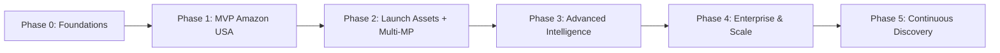

# roadmap.md — SellBodr

A phased plan from MVP to Enterprise. Each phase is shippable and gated by the success criteria listed.

---

## Phase 0 — Foundations (Weeks 1–3)

**Goal:** Repo, infra, auth, and the scoring core exist.

- Turborepo + pnpm monorepo scaffolding
- NestJS API skeleton, Next.js web skeleton
- PostgreSQL + Redis + Elasticsearch provisioned (docker-compose for local, Terraform for cloud)
- Auth: JWT + Google OAuth, RBAC roles seeded
- `packages/core/scoring` with versioned formulas + unit tests
- CI pipeline (lint, typecheck, test, build)

**Exit:** A user can sign up, log in, and the scoring functions are tested and importable.

---

## Phase 1 — MVP: Single-Marketplace Opportunity Engine (Weeks 4–9)

**Goal:** End-to-end for **India → Amazon USA** only.

- Product Discovery Agent (best sellers, trending, rising)
- Marketplace Research Agent (demand/competition signals)
- Profitability Engine (Amazon FBA fee model, landed cost, net profit, ROI, break-even)
- Opportunity Score v1 computed and stored
- Supplier Discovery Agent (IndiaMART/TradeIndia connectors, basic)
- Opportunity Dashboard + Product Research Dashboard
- AI Recommendation card (Launch/Hold/Reject + confidence)
- Starter & Pro tiers with metering (Stripe)

**Exit:** A Pro user gets a ranked list of Amazon USA opportunities with sourcing and full profit breakdown.

---

## Phase 2 — Launch Assets + Multi-Marketplace (Weeks 10–16)

**Goal:** Make recommendations actionable and expand marketplaces.

- Listing Optimization Agent + SEO Keyword Agent + Product Launch Agent
- Marketplace Launch Advisor (price, positioning, USPs, title, bullets, description)
- Add Amazon UK, DE, CA, AU + Etsy + eBay
- Marketplace Dashboard, Profitability Dashboard, Listing Optimization Dashboard
- Report Generation Agent → exportable opportunity reports (PDF)
- Trend Analysis Agent (seasonal/evergreen/rising classification)

**Exit:** A user picks a product and receives a complete, marketplace-specific launch kit across 7 marketplaces.

---

## Phase 3 — Advanced Intelligence (Weeks 17–24)

**Goal:** Deepen the moat.

- Product Gap Finder (high demand + weak listings)
- Review Intelligence (competitor review mining → pain points)
- Keyword Intelligence (marketplace-specific)
- Product Bundle Generator
- AI Brand Builder (names, logo concepts, packaging, positioning)
- Competition Analysis Agent (full competitor teardown)
- Walmart Marketplace + Shopify ecosystem + TikTok Shop
- Agency tier: multi-user workspaces, portfolio management

**Exit:** Agencies manage client portfolios; advanced finders drive differentiated picks.

---

## Phase 4 — Enterprise & Scale (Weeks 25–36)

**Goal:** Platformize.

- Public REST API + API keys + usage metering (Enterprise tier)
- White-label theming
- Bulk scoring + batch jobs
- Future marketplaces: Temu, Noon, Lazada, Shopee
- Advanced observability (Grafana/Prometheus dashboards, SLOs)
- Model routing + eval harness hardening
- SOC2-readiness (audit logs, access reviews, encryption posture)

**Exit:** Enterprises integrate via API and white-label; platform meets scale + compliance bars.

---

## Phase 5 — Continuous Discovery Loop (Ongoing)

- Always-on crawl + re-score pipeline (opportunities refresh automatically)
- Feedback loop: realized seller outcomes retrain scoring weights
- Marketplace expansion playbook (add a new marketplace in < 2 weeks)

---

## Dependency Graph (Mermaid)

## Release Gates

Every phase must pass: typecheck, ≥80% core coverage, security scan clean, scoring eval suite green, and one e2e happy-path test for the new surface.
