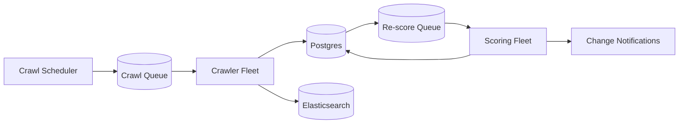

# scaling.md — BorderScout AI

How the platform scales from MVP to enterprise load, and how each bottleneck is addressed.

---

## 1. Scaling Philosophy

Start as a **modular monolith** (one NestJS API + a worker pool) for speed of iteration. Extract independently-scaling pieces only when a real bottleneck appears. Keep the **scoring core stateless and pure** so it scales horizontally without coordination.

---

## 2. Scale Stages

| Stage | Users | Architecture move |
|-------|-------|-------------------|
| **Seed** | <1k | Single API service + worker pool on ECS Fargate; single RDS |
| **Growth** | 1k–50k | Add read replicas, separate worker fleets per job type, Redis cluster |
| **Scale** | 50k–500k | Move to EKS; extract crawler/scoring/report services; OpenSearch cluster scale-out |
| **Enterprise** | 500k+ | Multi-region reads, sharded queues, dedicated tenants for white-label |

---

## 3. Bottlenecks & Mitigations

### 3.1 Model Cost & Latency (the #1 cost)
- **Model Gateway caching**: dedupe identical agent calls (`agent + inputHash + modelVersion`).
- **Model routing**: cheap/fast model for classification/extraction; premium model only for reasoning/copy.
- **Batching**: batch embeddings and re-scoring jobs.
- **Per-pipeline budget caps** prevent runaway spend.

### 3.2 Connector Rate Limits (marketplaces/suppliers)
- Centralized **rate-limited connector layer** with per-source token buckets.
- **Crawl scheduler** spreads load; respects upstream limits; backoff + circuit breakers.
- Cache connector responses with TTL; re-crawl only when stale.

### 3.3 Pipeline Throughput
- **BullMQ** worker fleets scale on **queue depth** (autoscaling metric).
- Pipelines run as DAGs; independent agents parallelize.
- Idempotent, resumable jobs; dead-letter queue for poison messages.

### 3.4 Database
- **Read replicas** for dashboard-heavy reads; writes to primary.
- **PgBouncer** connection pooling.
- Partition large tables (`opportunities`, `agent_steps`) by time.
- Hot scores cached in Redis; ES owns search/aggregation load.

### 3.5 Search / Aggregations
- Elasticsearch/OpenSearch cluster sized to index size; separate hot/warm tiers.
- Heavy aggregations precomputed into rollups where possible.

### 3.6 Realtime (WebSocket)
- Socket.IO with **Redis adapter** for horizontal fan-out across API instances.
- Backpressure: progress events throttled per job.

---

## 4. Continuous Discovery Loop at Scale

- Decoupled crawl → store → re-score → notify pipeline; each fleet scales independently on its queue depth.

---

## 5. Caching Strategy (layered)

1. CDN (CloudFront) — static + cacheable GETs.
2. Model response cache (Redis).
3. Score/opportunity cache (Redis, TTL + event invalidation).
4. Query cache for expensive aggregations.

---

## 6. Multi-Tenancy & Isolation

- Logical isolation via `organization_id` on every row + repository-level enforcement.
- Enterprise/white-label can get dedicated DB schemas or instances.
- Noisy-neighbor protection: per-tenant rate + cost budgets.

---

## 7. Cost Controls

- Track **cost per opportunity** and **per tenant**; alert on regressions.
- Spot/Fargate-Spot for non-urgent worker fleets.
- Storage lifecycle (S3 IA/Glacier for old reports).

---

## 8. Reliability Targets

- API read p95 < 300ms; write p95 < 600ms.
- Pipeline completion SLO per phase; error budget alerting.
- Multi-AZ everywhere; cross-region DR for data stores.

---

## 9. Adding a New Marketplace (playbook)

1. Implement connector behind the typed interface (`packages/connectors`).
2. Add fee schedule + shipping/tax tables.
3. Register marketplace row (`active=false` until validated).
4. Add scoring fit rules + golden eval fixtures.
5. Flip the flag, gradual rollout. Target: < 2 weeks per marketplace.
