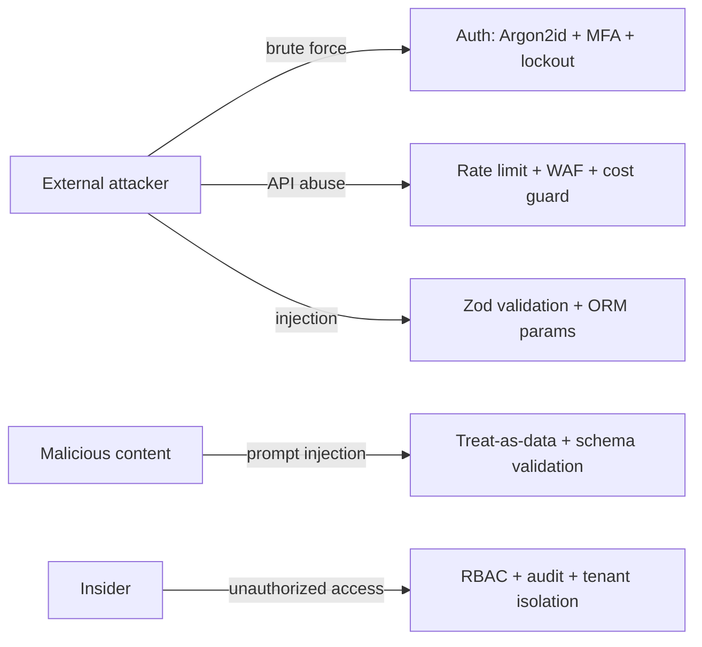

# security.md — BorderScout AI

Security architecture covering RBAC, MFA, audit logs, encryption, and API rate limiting, plus the surrounding controls.

---

## 1. Authentication

- **JWT**: short-lived access tokens (15 min) + rotating refresh tokens (7 days, single-use, stored hashed). Refresh reuse → token family revoked.
- **OAuth 2.0 / Google Login**: PKCE flow; email verified by provider.
- **Password storage**: Argon2id, per-user salt, pepper from KMS.
- **MFA (TOTP)**: app-based 2FA. Required for `owner`/`admin` and all Enterprise users. Secrets encrypted at rest (envelope encryption via KMS). Recovery codes hashed.

---

## 2. RBAC (Role-Based Access Control)

Roles scoped to an **organization** (and optionally a **workspace** for Agency).

| Role | Capabilities |
|------|--------------|
| **owner** | Full control, billing, delete org, manage API keys |
| **admin** | Manage users/workspaces, all data, no billing delete |
| **member** | Run searches, view/edit opportunities, generate assets |
| **viewer** | Read-only |

- Enforced at the API via a NestJS `RolesGuard` + policy layer (resource-level checks: `can(actor, action, resource)`).
- Workspace membership (`workspaces.members`) gates Agency multi-user access.
- API keys (Enterprise) carry **scopes** (e.g. `opportunities:read`, `searches:write`) — least privilege.

---

## 3. Audit Logging

- **Append-only** `audit_logs` table; no updates/deletes (enforced by DB trigger + restricted role).
- Every state-changing action emits a domain event → audit consumer records actor, action, resource, before/after metadata, IP, timestamp.
- Covered actions: auth events, opportunity create/refresh/archive, asset generation, supplier access, report export, billing changes, API key lifecycle, role changes.
- Retention: ≥ 1 year (Enterprise configurable); exportable for compliance.

---

## 4. Encryption

- **In transit:** TLS 1.2+ everywhere; HSTS; internal service mTLS at scale.
- **At rest:** RDS, ElastiCache, OpenSearch, S3 all encrypted with AWS KMS CMKs.
- **Field-level:** MFA secrets, OAuth tokens, API key secrets encrypted with envelope encryption (KMS data keys); only key **prefix + hash** stored for keys.
- **Key management:** KMS with rotation; secrets in AWS Secrets Manager; no secrets in code or env files in repo.

---

## 5. API Rate Limiting & Abuse Prevention

- **Redis-backed sliding-window** limiter per principal (user/API key/IP).
- Limits by plan (see `monetization.md`); `429` + `Retry-After` + `X-RateLimit-*` headers.
- **Cost guard:** per-pipeline model-spend caps per plan; circuit-break on budget exceed.
- **WAF (CloudFront/AWS WAF):** common rule set, bot control, geo rules as needed.
- Idempotency keys prevent duplicate expensive operations.

---

## 6. Data Protection & Privacy

- PII minimized; data classification (public/internal/confidential/restricted).
- Tenant isolation: every query scoped by `organization_id`; row-level checks in repositories.
- Right-to-delete: soft delete + scheduled hard-delete job; cascades documented.
- Backups encrypted; restore tested quarterly.

---

## 7. Application Security

- Input validation with Zod DTOs on every endpoint; output serialization whitelists.
- ORM (Prisma) parameterization prevents SQLi; ES queries sanitized.
- Output encoding + CSP to mitigate XSS; SameSite cookies; CSRF tokens for cookie-based flows.
- Dependency scanning (Renovate + audit) and SAST in CI; container image scanning.
- Secrets scanning pre-commit + CI.

---

## 8. AI-Specific Security

- **Prompt-injection defense:** untrusted connector/web content is treated as data, never instructions; system prompts isolated; tool outputs validated against schemas.
- **Output validation:** all agent JSON Zod-validated; unverifiable facts flagged and excluded from scoring (no model-asserted supplier/price/fee influences a decision without connector grounding).
- **PII redaction** before sending content to model providers where feasible.
- Model gateway logs are access-controlled; no secrets in prompts.

---

## 9. Incident Response & Monitoring

- Sentry alerts + Prometheus alerting rules (auth failures spike, rate-limit storms, queue backlog).
- Runbooks for credential leak, data exposure, connector compromise.
- On-call rotation; severity levels + comms plan.

---

## 10. Compliance Posture

- Engineered toward **SOC 2** controls: access reviews, change management, audit trails, encryption, vendor management.
- GDPR/DPDP alignment for personal data handling (Indian sellers + global users).

---

## Threat Model (summary)

