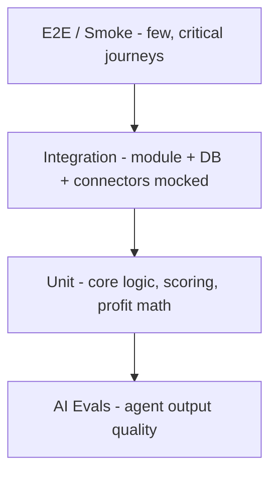

# testing.md — BorderScout AI

Test strategy across the monorepo, with hard coverage gates and AI-specific evaluation.

---

## 1. Test Pyramid



| Layer | Tooling | Scope |
|-------|---------|-------|
| **Unit** | Vitest | `packages/core` scoring/profit, pure functions, utils |
| **Integration** | Vitest + Testcontainers | NestJS modules against real Postgres/Redis/ES in containers; connectors mocked |
| **E2E** | Playwright | Web journeys: sign-up → search → opportunity → launch assets → report |
| **AI Evals** | Custom harness (`packages/agents`) | Agent output schema + quality on fixtures |
| **Contract** | Pact / OpenAPI diff | API ↔ web client ↔ SDK |
| **Load/Perf** | k6 | Pipeline throughput, dashboard reads |

---

## 2. Coverage Gates (CI-enforced)

| Area | Minimum |
|------|---------|
| `packages/core` (scoring, profit, money) | **90%** lines/branches |
| API modules | 80% |
| Web critical components (score/profit) | 75% |
| Overall | 80% |

Build fails below gate. Coverage trends tracked over time.

---

## 3. What We Test Hardest

### Scoring (sacred)
- Golden-master tests: fixed inputs → expected sub-scores + Opportunity Score per `scoreVersion`.
- Property tests: monotonicity (higher demand never lowers Opportunity Score, all else equal), bounds (0–100), determinism.
- Version isolation: changing v2 must not alter v1 golden outputs.

### Profitability (deterministic money math)
- Fee schedules per marketplace verified against fixtures.
- Money value object: no float drift, currency mismatches throw.
- Recalculate endpoint: assumption changes produce expected deltas.

### Pipelines
- Orchestrator handles partial failures (one agent fails → opportunity `partial`, others persist).
- Idempotency: re-running a job with same key produces no duplicates.

---

## 4. AI Agent Evaluation

- **Schema conformance:** every agent output validated against its Zod schema (100% required).
- **Grounding checks:** asserted suppliers/prices/fees must be traceable to a connector fixture; ungrounded facts must be flagged `unverified` (test that they are excluded from scoring).
- **Quality rubrics:** for generative outputs (listing copy, brand names) a rubric-based LLM-judge eval scores relevance/clarity/marketplace-fit; thresholds gate releases.
- **Regression set:** curated fixtures (product+marketplace cases) re-run each release; alert on metric drift (e.g., recommendation flips).
- **Cost/latency budgets:** evals assert per-agent token + latency within budget.

---

## 5. Connector Testing

- Each connector has a recorded-fixture (VCR-style) suite + a periodic **live contract test** in staging to catch upstream changes.
- Circuit-breaker and retry behaviour unit-tested with fault injection.

---

## 6. Security Testing

- Authz tests per role × endpoint (RBAC matrix).
- Rate-limit tests (429 + headers).
- Prompt-injection fixtures: malicious connector content must not alter agent instructions.
- Dependency/secret/container scans in CI.

---

## 7. Test Data

- Factories (per entity) for deterministic seeds.
- Anonymized fixtures only; no real PII in test data.
- Separate test DB per CI job (Testcontainers) — full isolation.

---

## 8. CI Wiring

```
pnpm lint && pnpm typecheck && pnpm test:unit \
  && pnpm test:integration && pnpm test:eval \
  && pnpm build && pnpm test:e2e (staging)
```

E2E + evals run on staging post-deploy; failures block prod promotion.

---

## 9. Definition of Done (per feature)

- Unit + integration tests added; coverage gate met.
- If touching scoring/profit: golden + property tests updated, version bumped if formula changed.
- If touching an agent: schema + grounding + rubric evals updated.
- One e2e happy-path for new user-facing surface.
- Docs updated in the same PR.
