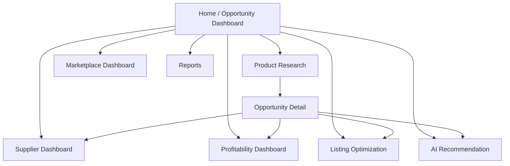

# uiux.md — BorderScout AI

UI/UX specification: the eight dashboards, screen structure, navigation, component breakdown, and design system. Built with Next.js App Router + Tailwind + ShadCN UI.

---

## 1. Design Principles

1. **Decisions over data** — every screen ends in a clear action (Launch / Source / Optimize / Export).
2. **Show the math** — scores and profit are always expandable into their breakdown.
3. **Progressive disclosure** — summary first, drill-down on demand.
4. **Live feedback** — pipeline progress streams via WebSocket.

## 2. Design System

- **Tokens:** Tailwind theme; primary brand color, success/warn/danger for recommendation states.
- **Score color scale:** 0–39 red, 40–69 amber, 70–100 green (applied to gauges/badges).
- **Components (ShadCN):** Card, Table (TanStack), Tabs, Dialog, Sheet, Badge, Progress, Tooltip, Command palette.
- **Charts (Recharts):** radial score gauge, profit waterfall, trend line, competitor scatter.
- **Layout:** persistent left nav + top bar (org/workspace switcher, search, plan/usage). Responsive down to tablet.

---

## 3. Navigation Map



---

## 4. The Eight Dashboards

### 4.1 Opportunity Dashboard (home)
- Ranked table of opportunities: product, marketplace, Opportunity Score gauge, recommendation badge, net profit, confidence.
- Filters: marketplace, country, category, min score, recommendation.
- "New Search" launches the pipeline; live progress drawer shows agent-by-agent status.

### 4.2 Product Research Dashboard
- Deep view of a candidate: demand signals, trend chart (seasonal/evergreen tag), review growth, category growth, search demand.
- "Find Suppliers" and "Analyze Profit" CTAs.

### 4.3 Supplier Dashboard
- Sourcing candidates table: supplier, source (IndiaMART/TradeIndia/verified/artisan/factory), product cost, MOQ, lead time, capacity, export experience, quality, feasibility badge.
- Compare suppliers side-by-side.

### 4.4 Marketplace Dashboard
- Per-marketplace comparison for the same product: Demand/Competition/Saturation/Trend/Fit sub-scores, price band, restrictions.
- Recommends the **best marketplace + country**.

### 4.5 Profitability Dashboard
- Profit **waterfall**: sale price → product → packaging → shipping → FBA → referral → storage → ads → tax → net profit.
- ROI, break-even units, monthly/annual projections.
- Editable assumptions (price, ACOS, volume, FX) → live recalc.

### 4.6 Listing Optimization Dashboard
- Generated SEO title, 5 bullets, description, positioning, USPs, keyword groups, recommended price.
- Inline edit + copy-to-clipboard per field; marketplace char-limit indicators.
- Tabs: Listing | Keywords | Brand | Bundles | Review Insights.

### 4.7 AI Recommendation Dashboard
- The decision card: Launch/Hold/Reject + confidence %, with the full sub-score breakdown and rationale.
- "Why this recommendation" expander showing each signal's contribution.

### 4.8 Reports Dashboard
- List of generated reports; generate new (PDF/JSON); download via signed URL; share within workspace.

---

## 5. Opportunity Detail (the spine)

Tabbed page binding everything for one opportunity:
`Overview · Research · Suppliers · Profitability · Competition · Listing · Recommendation · Report`.
Header shows the score gauge, recommendation badge, and primary CTA (Generate Launch Assets).

---

## 6. Onboarding Flow

1. Sign up (Google or email) → org created.
2. Pick goal (first product / scale catalog / agency).
3. Pick target marketplace + category.
4. First search auto-runs; activation = reaching first full opportunity report.

---

## 7. Component Architecture (web)

```
apps/web/
├── app/
│   ├── (auth)/login, register
│   ├── (dash)/opportunities, research, suppliers, marketplace,
│   │          profitability, listing, recommendation, reports
│   └── (dash)/opportunities/[id]/...tabs
├── components/
│   ├── score/ (ScoreGauge, ScoreBreakdown, RecommendationBadge)
│   ├── profit/ (ProfitWaterfall, AssumptionsForm)
│   ├── tables/ (OpportunityTable, SupplierTable)
│   ├── pipeline/ (LiveProgressDrawer)
│   └── ui/ (ShadCN primitives)
├── lib/ (api client, query hooks, ws client)
└── stores/ (zustand UI state)
```

## 8. Realtime UX

- Starting a search opens a non-blocking **Live Progress Drawer** showing each agent's status (queued → running → done) with a progress bar, powered by `/realtime` WS events.

## 9. Accessibility & i18n

- WCAG AA: keyboard nav, focus rings, ARIA on gauges/tables, color not sole signal (icons + labels on score states).
- i18n-ready (next-intl); currency/number formatting per marketplace locale.

## 10. White-Label (Enterprise)

- Theme tokens, logo, and domain pulled from `organizations.white_label_config`; applied at layout root.
